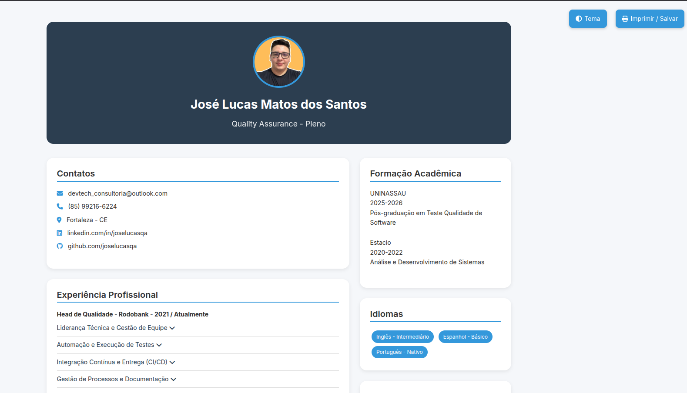

# Currículo Online - José Lucas

Um currículo digital moderno e interativo desenvolvido com tecnologias web front-end. Oferece experiência de visualização responsiva e recursos interativos.

## ✨ Funcionalidades Principais

- **Design Responsivo**  
  Adapta-se a qualquer dispositivo (desktop, tablet, mobile)

- **Tema Claro/Escuro**  
  Alternância dinâmica entre modos de visualização

- **Seções Interativas**  
  Accordion para detalhamento de experiências profissionais

- **Organização de Habilidades**  
  Categorização em Soft Skills e Hard Skills com tags coloridas

- **Versão Imprimível**  
  Layout otimizado para impressão/PDF

- **Semântica HTML**  
  Estrutura otimizada para SEO e acessibilidade

- **Cross-browser**  
  Compatível com todos os navegadores modernos

## 🛠 Tecnologias Utilizadas

- **HTML5** (Estrutura semântica)
- **CSS3** (Flexbox, Grid, Media Queries)
- **JavaScript** (ES6 - Interatividade)
- **Bootstrap** (Grid system e utilidades)
- **Font Awesome** (Ícones)
- **Google Fonts** (Tipografia Inter)

## Link Visualização 
- https://joselucasqa.github.io/